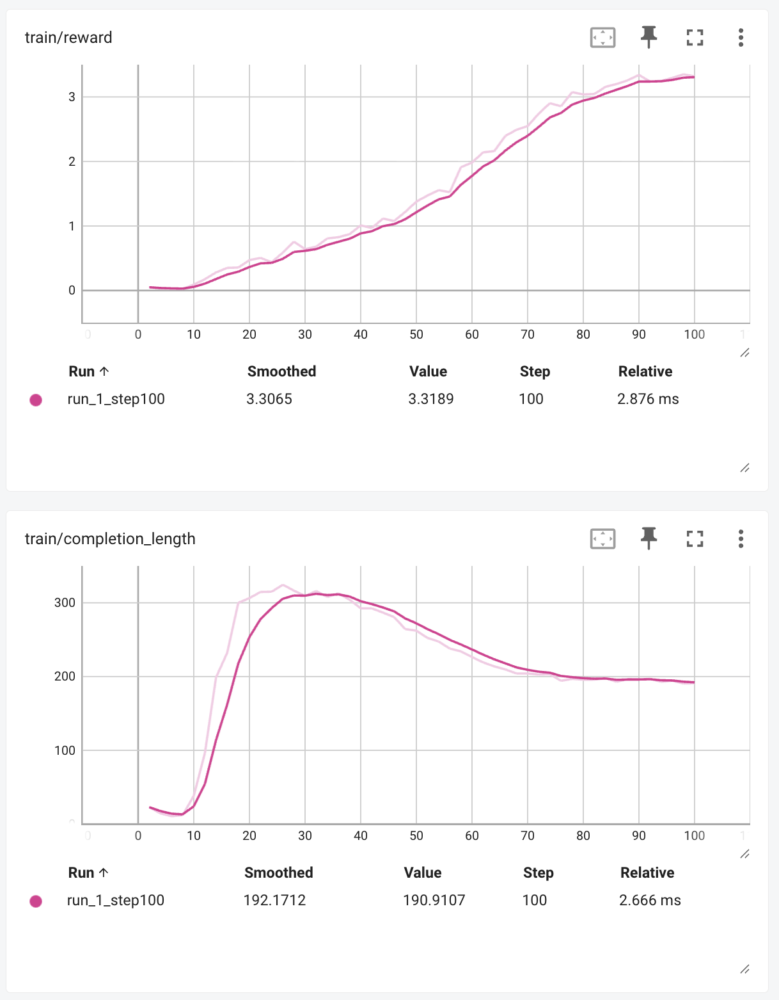

# Attack Graph Challenge - AI Agent Cybersecurity Reasoning Training

This project trains autonomous AI agents to perform cybersecurity penetration testing using **Group Relative Policy Optimization (GRPO)** and the **NVIDIA NeMo RL** framework. This project teaches language models cybersecurity reasoning and tool usage that requires adaptive reasoning and planning to succeed through reinforcement learning.

## Overview

This repository trains an autonomous AI agent for cybersecurity penetration testing using **Group Relative Policy Optimization (GRPO)** and the **NVIDIA NeMo RL** framework, and using **NeMo Data Designer** for training scenario generation.

At its core, this project frames the cybersecurity challenge as a **graph traversal optimization problem**. The agent learns to find the optimal path through a network graph under "fog of war" conditions, where it must explore, discover dependencies, and plan multiple steps ahead.

While the application is security-focused, the technique of using reinforcement learning for graph-based reasoning is broadly applicable to other domains like logistics planning, drug discovery, or social network analysis. The agent learns to:
- Explore networks with incomplete information.
- Execute multi-step sequences with tool dependencies.
- Distinguish useful information from distractor noise ("red herrings").
- Achieve a final goal through systematic planning.

## Dataset Generation with NeMo Data Designer

High-quality training scenarios are generated using **NeMo Data Designer**, which provides capabilities for creating consistent, scalable, and statistically varied synthetic scenarios.

### Quick Start: Generate Your Own

The script below creates `attack_graph_complex_50000.jsonl` with 50,000 unique training scenarios in about 90 seconds.

```bash
python dataset_generation/design_attack_dataset.py
```

**Requirements**: This requires a local deployment of the [NeMo Data Designer service](https://docs.nvidia.com/nemo/microservices/latest/generate-synthetic-data/index.html).

### Pre-generated Dataset on Hugging Face

For convenience, a dataset containing 50,000 complex scenarios already generated with NeMo Data Designer is available for download from the Hugging Face Hub. This allows you to skip the dataset generation step.

**[➡️ Download from Hugging Face Datasets](https://huggingface.co/datasets/meowterspace45/attack_graph_challenge)**

## How Success is Measured

An agent's generated attack plan is evaluated by a stateful simulator. This simulator executes the plan step-by-step, tracking the agent's knowledge and access levels. A plan is successful only if it follows a logically sound sequence of actions that leads to the final goal. The simulator enforces key rules:

  - **Prerequisites**: Tools like `exploit` cannot be used on a vulnerability the agent has not yet discovered via a `scan`.
  - **Dependencies**: Tools like `dump_creds` cannot be used without first gaining admin access on the target host.
  - **Accuracy**: The agent must use the specific information (e.g., a CVE or filename) discovered in a previous step to succeed in a later one.

## The Core Challenge: Learning to Reason

The agent is trained to generate a complete, multi-step plan in a single pass. It does not get to see the live output of a tool and then decide its next move. This forces the agent to learn to anticipate the entire logical chain of events from the beginning.

### The Placeholder System

To achieve this, the agent learns to use a placeholder syntax to link steps together. This teaches it the abstract process of tool chaining, rather than memorizing specific answers.

Example of a Successful Plan:

```
<think>
I will scan the WebServer first. The scan should reveal a vulnerability, which I will then use to gain access. After that, I will dump credentials to pivot to the next server.
</think>
<answer>
1. scan(WebServer)
2. exploit(WebServer, @step1_cve)
3. dump_creds(WebServer)
4. use_creds(DBServer, @step3_creds)
</answer>
```

### The "Aha\!" Moment: Ignoring Red Herrings

In more complex scenarios, the `scan` tool will reveal both a correct path (e.g., a readable config file) and a decoy (a fake, non-functional CVE). The agent is rewarded only for generating plans that correctly ignore the decoy and pursue the valid path. This is the core test of its reasoning ability.

## The Experiment: Learning Cybersecurity Reasoning

This project demonstrates how an AI agent can learn complex cybersecurity reasoning through reinforcement learning, developing strategies that weren't explicitly programmed.

### Training Results

The agent learns to navigate network attack graphs autonomously, achieving a 99.2% average win rate in the final 20 training steps. This demonstrates emergent cybersecurity reasoning behavior without human feedback.

### Training Progress & Results

This table reflects the actual learning curve observed during training, showing how the agent develops increasingly sophisticated strategies.
| Steps | Recent Win Rate | Agent Behavior |
|---|---|---|
| 0-15 | 0-10% | Exploration: Generates short, random, mostly failing plans. |
| 15-50 | 10-60% | "Aha\!" Moment: Discovers that long, chained plans yield high rewards. Win rate rapidly increases. |
| 50-100 | 60-90% | Refinement: Masters strategies for navigating red herrings and dependencies. |
| 100-160 | 90-99.2% | Mastery: Achieves 99.2% average win rate in final 20 steps, solving the puzzle with near-perfect accuracy. |

### Training Metrics Visualization


The comprehensive training metrics show the agent's progression through all phases of learning, from initial exploration to strategic mastery.



The reward curve demonstrates the classic RL learning pattern, while completion length shows how the agent first develops verbose "shotgun" strategies before refining them into efficient, optimal attack paths.


## Training Infrastructure & Requirements

### Model & Hardware Specifications

  - **Base Model**: Qwen 2.5-3B with supervised fine-tuning (SFT)
  - **Training Method**: Group Relative Policy Optimization (GRPO)
  - **Recommended Requirements**: 8x L40s GPUs for full parameters training
  - **Alternative Setup**: Single GPU training with PEFT/QLoRA (coming soon)

### Setup and Training

1.  **Clone this repository:**
    ```bash
    git clone https://github.com/zredlined/attack-graph-challenge.git
    cd attack-graph-challenge
    ```
2.  **Create and activate a Python virtual environment:**
    ```bash
    python3 -m venv .venv
    source .venv/bin/activate
    ```
3.  **Install all dependencies:**
    ```bash
    pip install -r requirements.txt
    ```
4.  **Run GRPO Training:**
    (The script will automatically download the dataset from Hugging Face)
    ```bash
    python run_grpo_attack_graph.py
    ```

## Resources & Further Reading

### Project Resources

  - [Attack Graph Challenge GitHub Repository](https://github.com/NVIDIA/grpo-attack-graph-challenge)

### NeMo Data Designer

  - [Data Designer Documentation](https://docs.nvidia.com/nemo/microservices/latest/generate-synthetic-data/index.html)
  - [Data Designer Examples](https://github.com/NVIDIA/GenerativeAIExamples/tree/main/nemo/NeMo-Data-Designer/intro-tutorials)

### Key Papers & References

  - [NVIDIA NeMo RL Framework](https://github.com/NVIDIA-NeMo/RL)
  - [Minimal GRPO implementation](https://github.com/jiayi-pan/minimal-grpo) by Jiayi Pan
  - [Hugging Face Trainer implementation of GRPO](https://huggingface.co/blog/grpo) by Phil Schmid
